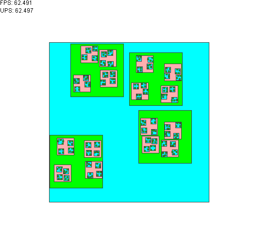

Easy Sprite
===============

Easy Sprite is a graphics and animation library that provides classes that can represent moving pieces of animations that can help create video games or other graphical applications.

## Requirements

* Java 1.8

## Installation

To use Easy Sprite in your Maven managed project use the
following dependency definition:

    <dependency>
        <groupId>org.jamesgames</groupId>
        <artifactId>easy-sprite</artifactId>
    </dependency>

The source code isn't hosted on any maven repo, so in the meantime you'll have to download this project from here on Github and build it with maven to have it exist on your machine's local maven repository (easy to do if you build it via your projects maven build where this project is a git submodule of your own project).

## Building

To manually build the project, download Maven and change the current
working directory to the directory containing pom.xml and run the
command "mvn install".
The default location for the Maven local repository is a directory structure of `/.m2/repository/`, found in the user's home directory.

## Credits

* James Murphy - JamesGames.Org(at)gmail.com